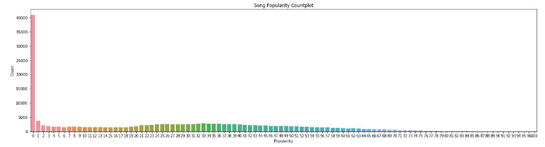
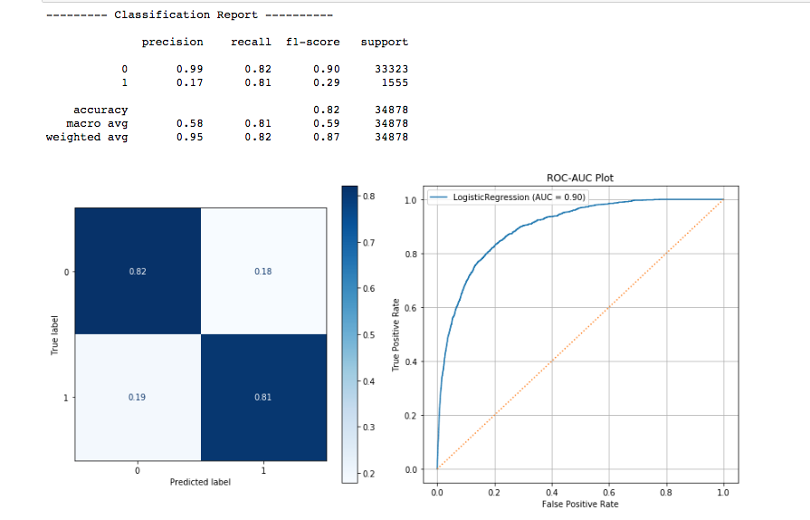
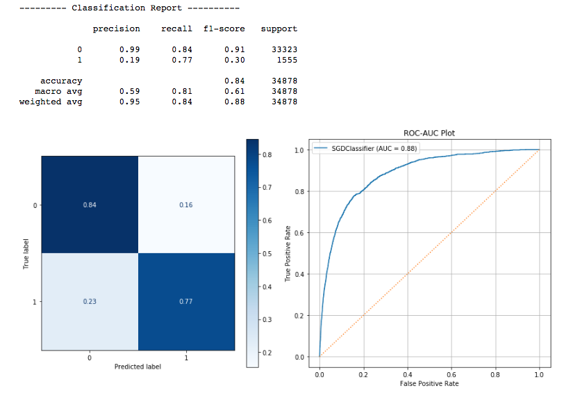
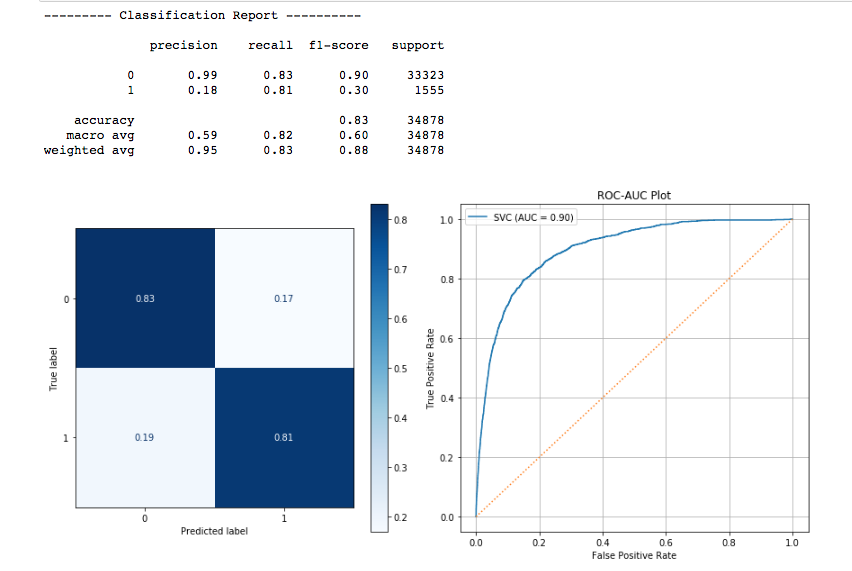
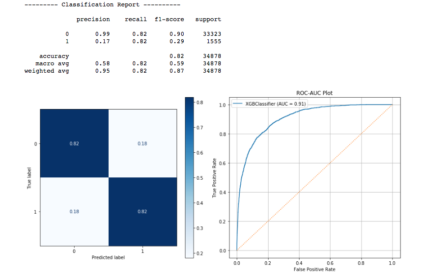
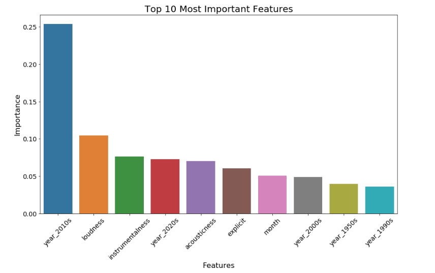
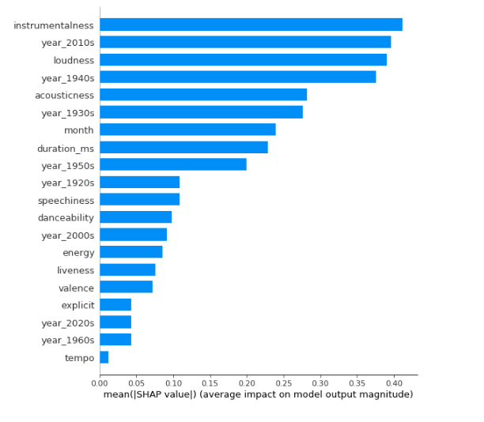
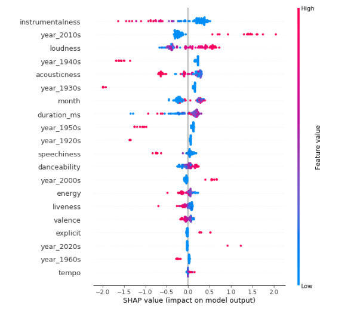

# Spotify Song Data Analysis

<center></center>
  
 
<h5>Note:</h5> This project is a work in progress and we are currently in the process of expanding on the concept.  This README will be updated as the project is updated.  Thanks! 
 
 
## Introduction
Spotify has emerged as the largest and most popular platform for streaming music in the world.  With millions of songs available as well as millions of users streaming them, Spotify is able to amass a huge amount of relevant music data and is generous enough to share this data through their Spotfy for Developers program.  With background as both a musician and a music industry professional, there is a giant curiosity about whether we can use machine learning to answer questions that have long eluded the entier industry, especially "What makes a hit?"

This project is a work in progress at the moment, but the goal is to analyze a large dataset of Spotify song data with the intention of answering the following questions:
- Using all possible data, what features make a song a 'hit'?
- Using strictly audio data, what features make a song a 'hit'?
- Can we create a model that can accurately predict whether a new song will be a 'hit'?

For now, we'll be working off of the 'data_cleaning.ipynb' and 'spotify_binary_classification.ipynb' notebooks.  Other notebooks found within the repo are a work in progress for future updates to the project.  

## Imports
Let's start off by getting a few imports in to start. We'll import more as we go along.

```python
# Regulars
import numpy as np
import pandas as pd
import seaborn as sns
import matplotlib.pyplot as plt
%matplotlib inline

# Model evaluation
from sklearn.metrics import confusion_matrix, plot_confusion_matrix
from sklearn.metrics import classification_report, plot_roc_curve

# tqdm
from tqdm import tqdm_notebook as tqdm
tqdm().pandas()
```

## Obtain
The importing and cleaning of the data is represented in the 'data_cleaning.ipynb' notebook and was a fairly straightforward process.  The dataset itself contains 174,389 rows and 19 columns representing a variety of metrics for each song.    

### Import Dataset
First thing's first, let's import the dataset and see what we're looking at.  

```python 
df = pd.read_csv('spotify_song_data.csv')
print(df.shape)
df.head()
```

Some of the metrics are simple to understand such as duration_ms, tempo, key, etc.  Others, such as instrumentalness and speechiness are a little more esoteric by name alone.  In an effort to not make this the longest README ever, I'll spare a full breakdown of each column, but if you're curious about each metric, there is a full description in each notebook and I'll define anything that comes up, if it's important.


### Data Cleaning
Luckily, the dataset is fairly clean and doesn't really require a ton of work.  There are no null values in the dataset, so that's a huge plus.  We'll go through the columns that needed a little massaging in order. 

#### Name
First, we'll set the name column as the index.  The name represents the title of the track.

```python
df.set_index('name', inplace = True)
df.head()
```

#### ID
The ID column is just an internal Spotify identifier for each track.  This doesn't affect the outcome of the project, so we can drop this column.

```python
df.drop('id', axis = 1, inplace = True)
df.head()
```

#### Year
We experimented with a few different approaches for this column.  At first, we converted the year to a string so it wouldn't be affected by scaling.  The downside here is that there are close to 100 years of songs represented here, so having the year as a string made the dataset unmanageble after one-hot encoding.  The approach that we settled on was binning the years into their respective decades.  This loop took a bit to run, so you'll see I employed tqdm to get a fun status bar.  

```python
for i in tqdm(df['year']):
    if i >= 1920 and i < 1930:
        df['year'] = df['year'].replace(i, '1920s')
    elif i >= 1930 and i < 1940:
        df['year'] = df['year'].replace(i, '1930s')
    elif i >= 1940 and i < 1950:
        df['year'] = df['year'].replace(i, '1940s')
    elif i >= 1950 and i < 1960:
        df['year'] = df['year'].replace(i, '1950s')
    elif i >= 1960 and i < 1970:
        df['year'] = df['year'].replace(i, '1960s')
    elif i >= 1970 and i < 1980:
        df['year'] = df['year'].replace(i, '1970s')
    elif i >= 1980 and i < 1990:
        df['year'] = df['year'].replace(i, '1980s')
    elif i >= 1990 and i < 2000:
        df['year'] = df['year'].replace(i, '1990s')
    elif i >= 2000 and i < 2010:
        df['year'] = df['year'].replace(i, '2000s')
    elif i >= 2010 and i < 2020:
        df['year'] = df['year'].replace(i, '2010s')
    elif i >= 2020 and i < 2029:
        df['year'] = df['year'].replace(i, '2020s')
```

#### Release Date
The release date is a string in the original dataset, so we changed it to a datetime oject.

```python
df['release_date'] = pd.to_datetime(df['release_date'])
```

Since we already have our years binned into decades and one hot encoding the release date would balloon our dataset, we made thi sa bit more manageable by pulling the release month from the datetime object and then just dropping the release date column.

```python
import datetime as dt
df['month'] = df['release_date'].dt.month
df.drop('release_date', axis = 1, inplace = True)
```

#### Artists
Okay so this one hurt a little bit and this is something we're going to be addressing in future work on this project.  The dataset consists of over 33,000 unique artists, which makes one-hot encoding kind of impossible with our machines.  It also doesn't seem like theres a sensible way to bin the column as it doesn't really take the individual artist's popularity into account.  For now, we're just going to drop this column for the sake of being able to move on with the project.  This will, for sure, be revisited.  

```python
df.drop('artists', axis = 1, inplace = True)
```

#### Popularity
This one took some serious thought and research.  We know that the popularity metric is a number from 1 to 100 (with 100 being the most popular) that is assigned to a song to denote it's popularity.  Spotify calculates this metric based on total streams, trends, and several other factors.  First we needed to see what we're working with in terms of value counts.  Then, we needed to make some sort of determination of what level of popularity constitues as a hit song.

```python
ax = plt.figure(figsize = (24, 6))
ax = sns.countplot(df['popularity'])
ax.set_title('Song Popularity Countplot')
ax.set_xlabel('Popularity')
ax.set_ylabel('Count')
plt.show();
```


> We can see from the figure above that an overhwelmingly large percentage of the songs have a popularity of 0 and the top of the scale is an extremely small percentage.  This is going to wreak havok on class weights.

<b>From Spotify:</b><br>
The popularity of the track. The value will be between 0 and 100, with 100 being the most popular. The popularity of a track is a value between 0 and 100, with 100 being the most popular. The popularity is calculated by algorithm and is based, in the most part, on the total number of plays the track has had and how recent those plays are. Generally speaking, songs that are being played a lot now will have a higher popularity than songs that were played a lot in the past. Duplicate tracks (e.g. the same track from a single and an album) are rated independently. Artist and album popularity is derived mathematically from track popularity. Note that the popularity value may lag actual popularity by a few days: the value is not updated in real time.

##### Binning Popularity
We'll make the following labels by binning hte popularity metric:<br>
0 - Not a hit<br>
1 - Hit

```python
for i in tqdm(df['popularity']):
    if i >= 65:
        df['popularity'] = df['popularity'].replace(i, 'Hit')
    else:
        df['popularity'] = df['popularity'].replace(i, 'Dud')

# Now for encoding it for 1 and 0
for i in tqdm(df['popularity']):
    if i == 'Hit':
        df['popularity'] = df['popularity'].replace(i, 1)
    else: 
        df['popularity'] = df['popularity'].replace(i, 0)
```

Now, we can save the clean dataframe.

```python
df.to_csv('clean_spotify_data.csv')
```

## Data Processing
From here on, we'll be working out of the 'spotify_binary_classification.ipynb' notebook.  We'll start the data processing by importing the clean dataframe and setting the indext to the song name.

```python
df = pd.read_csv('clean_spotify_data.csv').set_index('name')
```

Next we can do a train/test split on the dataset.

```python
from sklearn.model_selection import train_test_split

# Set X and Y
X = df.drop('popularity', axis = 1)
y = df['popularity']

# Train test split
X_train, X_test, y_train, y_test = train_test_split(X, y, test_size = 0.2, random_state = 30)

# See what we have
print('Shape of X_train:', X_train.shape)
print('Shape of X_test:', X_test.shape)
print('Shape of y_train', y_train.shape)
print('Shape of y_test', y_train.shape)
```

The next step in the process is to separate the colums into num_cols for numerical and cat_cols for categorical.

```python
# Separate into num_cols and cat_cols
num_cols = X_train.select_dtypes('number').columns
cat_cols = X_train.select_dtypes('object').columns
```

Now, we set up pipelines to transform the num_cols and cat_cols, then combine them into one single pipeline using Column Transformer. 

```python
from sklearn.pipeline import Pipeline
from sklearn.preprocessing import StandardScaler, OneHotEncoder
from sklearn.preprocessing import MinMaxScaler
from sklearn.compose import ColumnTransformer

# Create Pipelines for column transformer
num_transformer = Pipeline(steps = [('scaler', MinMaxScaler())])

cat_transformer = Pipeline(steps = [('encoder', OneHotEncoder(handle_unknown = 'ignore', 
                                                              sparse = False))])

# Create preprocessing pipeline with column transformer
preprocessing = ColumnTransformer(transformers = [('num', num_transformer, num_cols),
                                                  ('cat', cat_transformer, cat_cols)])

X_train_processed = preprocessing.fit_transform(X_train)
X_test_processed = preprocessing.transform(X_test)
```

Next, we needed to put the data back into a pandas dataframe to make life a little easier.

```python
# Get components together to make a dataframe
slice_pipe = preprocessing.named_transformers_['cat']
cat_features = slice_pipe.named_steps['encoder'].get_feature_names(cat_cols)

# Put data back into a clean dataframe
X_train_df = pd.DataFrame(X_train_processed, columns = [*num_cols, *cat_features])
X_test_df = pd.DataFrame(X_test_processed, columns = [*num_cols, *cat_features])
```

## Modeling
Next step is modeling!  The modeling phase was an extremely iterative process where we experimented with many different algorithms to try to find the best fit for the data, in order to provide the best results when looking at the feature importances.  For the sake of brevity, we're only going to include the "greatest hits" of the models here.  Feel free to check out every model we experiemented with in the main notebook.  

### Class Imbalances
The first step in this process is to deal with the crazy class imbalance issue.  As mentioned before, the target is the popularity column, and the value counts are 133,094 for 0 and 6,417 for 1.  Not great!  To deal with this, we'll use the RandomOverSampling method from sklearn. 

```python 
from imblearn.over_sampling import SMOTE, RandomOverSampler

# Set the oversampler
smote = RandomOverSampler(random_state = 30)

# Create the sampled X_train, y_train
X_train_resampled, y_train_resampled = smote.fit_resample(X_train_df, y_train)
```

This creates synthetic values for the target and now we have an equal number of values for both 0 and 1 with 133,094.

### Logistic Regression
Logistic Regression performed very well on this data with an 82% accuracy and an 82% average recall.  We used gridsearch on this algorithm to get the best possible combination of hyperparameters.  

```python
from sklearn.linear_model import LogisticRegressionCV
from sklearn.model_selection import GridSearchCV

# Set estimator 
estimator = LogisticRegression(random_state = 30)

# Set params 
params = {'penalty': ['l1', 'l2', 'elasticnet', 'none'],
          'C': [0.1, 1, 10],
          'solver': ['newton-cg','lbfgs', 'libliner', 'sag', 'saga'],
          'max_iter': [50, 100, 250]}

# Create Gridsearch
grid = GridSearchCV(estimator = estimator,
                    param_grid = params,
                    n_jobs = -1, 
                    verbose = 1, 
                    cv = 3)

# Fit gridsearch
grid.fit(X_train_resampled, y_train_resampled)


# Fit the model with best parameters
best_log_params = grid.best_params_
best_log_model = LogisticRegression(**best_log_params,
                                    random_state = 30)
best_log_model.fit(X_train_resampled, y_train_resampled)
```
We also created a function to help evaluate the scikit-learn models.

```python
def evaluate_model(model, X_test, y_test):
    '''Evaluates a scikit-learn classification model and displays a classification report, 
    a confusion matrix, and a ROC-AUC plot.
    
    -----------
    Parameters
    -----------
    model - the model you want to evaluate
    
    X_test - Dataset used in testing the model 
    
    y_test - Label used for predictions and evaluation the model'''
    
    # Predictions
    y_hat_test = model.predict(X_test)
    
    # Classification Report
    print('--------- Classification Report ----------\n')
    print(classification_report(y_test, y_hat_test))
    
    # Confusion Matrix
    fig, axes = plt.subplots(figsize = (12, 6), ncols = 2)
    plot_confusion_matrix(model, X_test, y_test, normalize = 'true',
                          cmap = 'Blues', ax = axes[0])
    
    # ROC-AUC Curve
    roc_auc_plot = plot_roc_curve(model, X_test, y_test, ax = axes[1])
    axes[1].legend()
    axes[1].plot([0,1], [0,1], ls = ':')
    axes[1].grid()
    axes[1].set_title('ROC-AUC Plot')
    fig.tight_layout()
    plt.show()

# Evaluate model
evaluate_model(best_log_model, X_test_df, y_test)
```



### Stochastic Gradient Descent
This model also performed well with an 84% accuracy and an 84% weighted recall.  As part of future work, we'll be doing more hyperparameter tuning to this algorithm.  

```python
from sklearn.linear_model import SGDClassifier

# Set model
sgd = SGDClassifier(random_state = 30)

# Fit model
sgd.fit(X_train_resampled, y_train_resampled)

# Evaluate Model
evaluate_model(sgd, X_test_df, y_test)
```



### Support Vector Machines
We used the SVC model from sklearn as our svm algorithm.  This was also very successful with an 83% accuracy and 82% weighted recall. Again, we'll be doing more hyperparameter tuning as part of future work. 

```python
from sklearn.svm import SVC

# Set Model
svc = SVC()

# Fit model
svc.fit(X_train_resampled, y_train_resampled)

# Evaluate Model
evaluate_model(svc, X_test_df, y_test)
```



### XGBoost
Finally, we used the XGBoost Classifier as a final model.  This also performed admirably without much hyperparameter tuning with an 82% accuracy and 82% weighted recall.

```python
from xgboost import XGBClassifier

# Set model
xgb = XGBClassifier()

# Fit model
xgb.fit(X_train_resampled, y_train_resampled)

# Evaluate Model
evaluate_model(xgb, X_test_df, y_test)
```




## Interpret
For the level of accuracy and the ease of use with pulling feature importances, we'll be moving forward with the XGboost model for interpreting the data.  First up, let's see which features were most important in predicting the popularity of a song.

### Feature Importances
First, we'll pull the feature importances from the model.

```python
# Pull feature importances
features_dict = {'Features': X_train_df.columns,
                 'Importance': xgb.feature_importances_}

# Convert to a dataframe
feature_importance = pd.DataFrame(features_dict, columns = ['Features', 'Importance'])

print(feature_importance.shape)
feature_importance.head(10)
```

Next, we removed all features with 0 importance and sorted the dataframe by importance.

```python
# Let's remove all features with a 0 importance
for i in feature_importance['Importance']:
    if i == 0:
        feature_importance['Importance'].replace(i, np.nan, inplace = True)
        
feature_importance.dropna(inplace = True)

# Now let's sort and see what we have
feature_importance.sort_values(by = ['Importance'], ascending = False, inplace = True)

print(feature_importance.shape)
feature_importance
```

Now for a nice visualize aid, we made a barplot of the top 10 most important features. 

```python
# Create a barpolot of feature importances
ax = plt.figure(figsize = (14, 8))
ax = sns.barplot(data = feature_importance.head(10),
                 x = 'Features', y = 'Importance')
ax.set_title('Top 10 Most Important Features', fontsize = 20)
ax.set_xlabel('Features', fontsize = 16)
ax.set_ylabel('Importance', fontsize = 16)
ax.tick_params(labelsize = 14)
plt.xticks(rotation = 45);
```



This gives us a pretty good look at what's most important, but we can get an even deeper look into the model using SHAP.

### SHAP
Using SHAP, we can get a more in-depth look into how the model is using each feature to predict popularity.  First, let's see what SHAP determines to be the most important features.

```python
import shap

# Setting up SHAP
X_shap = shap.sample(X_train_df, 100)
explainer = shap.TreeExplainer(xgb, X_train_df)
shap_values = explainer.shap_values(X_shap)

# Plot
fig = shap.summary_plot(shap_values, X_shap, plot_type = 'bar')
```



Looks good, but we can make a small alteration to the code for the plot and how much each feature affects the prediction as well as whether it affects positively or negatively.  

```python
shap.summary_plot(shap_values, X_shap)
```




## Conclusion
Over the last decade, Spotify has completely changed the face of the music industry. Streaming has become king and is the main way that music fans listen to their favorite artists. Spotify is the undeniable leader in this market and if your song is doing well on Spotify, you're song is a success. With millions of songs avaialble for streaming at any given moment, it's extremely hard for a new artist to cut through all the noise and find success for their songs. Perhaps, using machine learning, we can decode the elusive "Spotify algorithm" a bit and see if we can ascertain what actually makes a hit song.

### Results
Since we can't exactly tell someone that to write a hit song, you need to make it be the year 2010, we're going to focus our results on the elements that we can control.  These elements are Spotify's metrics for various aspects of the songs.  

<b>The analysis of this dataset yielded the following results:</b>
-  Higher levels of instrumentalness negatively affect the popularity of a song.
-  The louder the song, the more positively it affects the popularity.
-  The high the level of acousticness, the less popular a song is. 
-  Tracks with spoken words tend to not be popular.
-  Song duration has an inconclusive effect on the popularity of a song, surprisingly.

### Recommendations
<b>Based on these results, we can make the following recommendations to songwriters looking to create a song that has the potential to be popular on Spotify:</b>
- Produce your song using as few acoustic or live instruments as possible.
- Write vocals for every part and try to limit instrumental sections.
- Avoid using spoken word element in your song.
- Make sure to professionally master your track to high dB level as louder tracks are more popular.

### Future Work
<b>With more time, we will complete the following "next steps":</b>
- Rework the project to use a multiclass popularity target that would account for hit songs, solid singles, and duds.
- Spend more time tuning the models to achieve a higher level of accuracy. 
- Figure out a way to include the artist column in the dataset as the popularity of an artist will obviously affect the popularity of a song.
- Expand on the conecpt to be able to deploy a model that can predict whether a new song will be a hit or not.

<center><b><i> Thank you! </i></b></center>